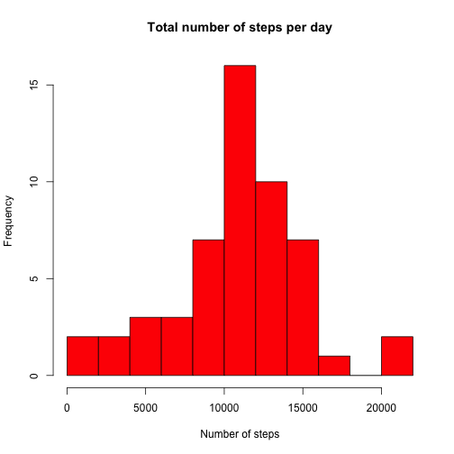
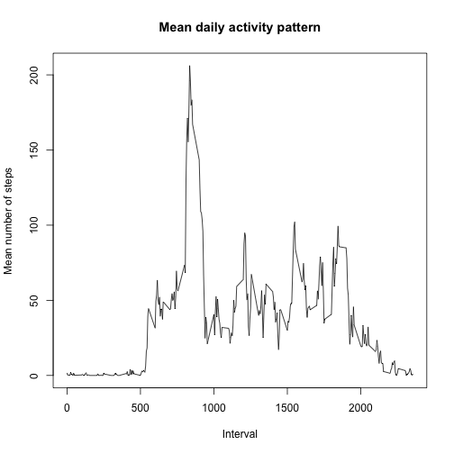
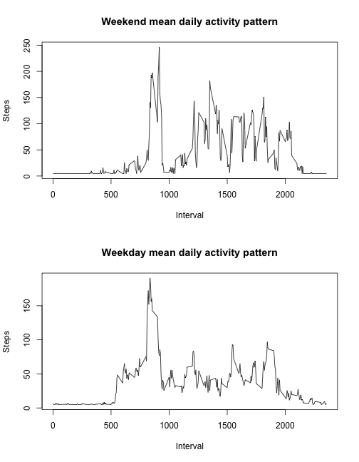

This document is intended to fulfill the requirements for Coursera's Reproducible Research peer assessment 1.
This assignment makes use of data from a personal activity monitoring device. This device collects data at 5 minute intervals through out the day. The data consists of two months of data from an anonymous individual collected during the months of October and November, 2012 and include the number of steps taken in 5 minute intervals each day.

## Loading and preprocessing the data
The variables included in this dataset are:

- steps: Number of steps taken in a 5-minute interval (missing values are coded as NA)

- date: The date on which the measurement was taken in YYYY-MM-DD format

- interval: Identifier for the 5-minute interval in which measurement was taken

The dataset is stored in a comma-separated-value file ("activity.csv"") and there are a total of 17,568 observations in this dataset.
To load the data from .csv file we use the R function read.csv. Data are supposed to be in the current working directory.


```r
activity<-read.csv("activity.csv")
```

We can look at the first rows of the data:

```r
head(activity,10)
```

```
##    steps       date interval
## 1     NA 2012-10-01        0
## 2     NA 2012-10-01        5
## 3     NA 2012-10-01       10
## 4     NA 2012-10-01       15
## 5     NA 2012-10-01       20
## 6     NA 2012-10-01       25
## 7     NA 2012-10-01       30
## 8     NA 2012-10-01       35
## 9     NA 2012-10-01       40
## 10    NA 2012-10-01       45
```
And to the structure of the dataset with the following command:

```r
str(activity)
```

```
## 'data.frame':	17568 obs. of  3 variables:
##  $ steps   : int  NA NA NA NA NA NA NA NA NA NA ...
##  $ date    : Factor w/ 61 levels "2012-10-01","2012-10-02",..: 1 1 1 1 1 1 1 1 1 1 ...
##  $ interval: int  0 5 10 15 20 25 30 35 40 45 ...
```
As we can see, dates are stores as factors, while steps and interval as integers.

## What is mean total number of steps taken per day?
To compute the mean total number of steps taken per day we proceed by first splitting the dataset by date, computing the total number of steps per day and then the mean over all days. Let's start by computing the total number of steps and plotting a histogram of the daily activity:

```r
daily_activity<-by(activity$steps,activity$date,sum)
hist(daily_activity,nclass=10,col="red",main="Total number of steps per day",xlab="Number of steps")
```

 

We can now compute the mean number of steps per day, remembering to remove NAs when computing the mean (for this part of the assignment we can ignore missing values):

```r
mean(daily_activity,na.rm=TRUE)
```

```
## [1] 10766.19
```

```r
median(daily_activity,na.rm=TRUE)
```

```
## [1] 10765
```
The mean total number of steps taken per day is thus about 10766 and the median 10765.

## What is the average daily activity pattern?
To compute the average daily activity pattern we can proceed as before by splitting the steps taken by the interval and then plotting the result as a time series against the interval.


```r
daily_pattern<-by(activity$steps,activity$interval,mean,na.rm=TRUE)
plot(levels(as.factor(activity$interval)),daily_pattern,type="l",main="Mean daily activity pattern",xlab="Interval",ylab="Mean number of steps")
```

 

We can now find the interval with the maximum number of steps taken with the following code:

```r
daily_pattern[daily_pattern==max(daily_pattern)]
```

```
##      835 
## 206.1698
```
Thus the highest activity occurs on average in the 8:35 interval with about 206 steps taken.


## Imputing missing values
Let's now consider the missing values in the dataset. The total number of missing values can be found easily:

```r
sum(is.na(activity$steps))
```

```
## [1] 2304
```

In the dataset there are thus 2304 NA values. A possible strategy to fill the NA values could be that of substituting the NA values with the steps mean over the entire dataset. We can then proceed as before for computing the daily sums:

```r
nona_activity=activity
nona_activity[is.na(nona_activity$steps),1]<-mean(nona_activity$steps,na.rm=TRUE)
```

As we can now see, the number of NA values in the dataset is zero:


```r
sum(is.na(nona_activity$steps))
```

```
## [1] 0
```

We can now proceed as before for calculating the mean and the median for the new dataset and compare the values with the ones obtained before:


```r
nona_daily_activity<-by(nona_activity$steps,nona_activity$date,sum)
mean(nona_daily_activity,na.rm=TRUE)
```

```
## [1] 10766.19
```

```r
median(nona_daily_activity,na.rm=TRUE)
```

```
## [1] 10766.19
```


## Are there differences in activity patterns between weekdays and weekends?
To answer this question we start by adding a new column to the dataset indicating whether each day is a weekend or weekday day. We can do this by using the mutate function of the dplyr library.


```r
library(dplyr)
nona_activity<-mutate(nona_activity,we=as.factor(ifelse(as.POSIXlt(as.Date(nona_activity$date,"%Y-%m-%d"))$wday>=6,"weekend","weekday")))
```

We can then go on by splitting the dataset in weekend and weekday days, calculating the mean daily activity and then plotting the results.


```r
we_activity<-filter(nona_activity,we=="weekend")
wd_activity<-filter(nona_activity,we=="weekday")
we_daily_pattern<-by(we_activity$steps,we_activity$interval,mean)
wd_daily_pattern<-by(wd_activity$steps,wd_activity$interval,mean)
par(mfrow=c(2,1))
plot(levels(as.factor(we_activity$interval)),we_daily_pattern,type="l",main="Weekend mean daily activity pattern",xlab="Interval",ylab="Steps")
plot(levels(as.factor(wd_activity$interval)),wd_daily_pattern,type="l",main="Weekday mean daily activity pattern",xlab="Interval",ylab="Steps")
```

 

As we can see from the figures, weekday activity is less than weekend activity, particularly during afternoon hours.


